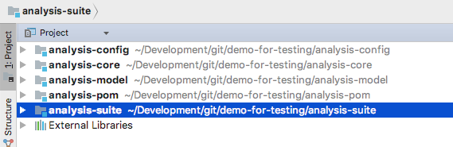

Static Analysis Suite
=====================

This module provides a common setup for the 
[static analysis plugins](https://wiki.jenkins.io/display/JENKINS/Static+Code+Analysis+Plug-ins) of Jenkins. 
It provides IntelliJ IDEA configuration files for formatter, coding style, inspections and the CheckStyle plug-in. 
Moreover, this module provides an aggregator POM for maven so you can build all the static code analysis plugins
with one call. There are also some small scripts provided that simplify the build process.

See also [the contributing guidelines](CONTRIBUTING.md) if you are planning to write a pull request.
 
All plug-ins are maintained by Ullrich Hafner. For more details please refer to the wiki
page https://wiki.jenkins-ci.org/x/CwDgAQ.

## Getting started

In order to get started you need to populate the individual modules using the following steps:

1. Create a new directory for the modules.
2. Change to this directory and clone the following modules (branch 'coverage' and module name without suffix): 
```
git clone -b coverage git@github.com:jenkinsci/analysis-model.git
git clone -b coverage git@github.com:jenkinsci/analysis-config-plugin.git analysis-config
git clone -b coverage git@github.com:jenkinsci/analysis-pom-plugin.git analysis-pom
git clone -b coverage git@github.com:jenkinsci/analysis-suite-plugin.git analysis-suite
git clone -b coverage git@github.com:jenkinsci/analysis-core-plugin.git analysis-core
```
3. (Note that you will need a fork of the GitHub modules above if you are planning to create a PR)
4. Verify the installation by starting `cd analysis-suite && mvn verify`. The output of the command should look like:
```
[INFO] ------------------------------------------------------------------------
[INFO] Reactor Summary:
[INFO] 
[INFO] Static Analysis Model .............................. SUCCESS [ 12.678 s]
[INFO] Static Analysis Plug-ins Tools Configuration ....... SUCCESS [  0.477 s]
[INFO] Static Analysis Plug-ins Parent POM ................ SUCCESS [ 20.362 s]
[INFO] Static Analysis Utilities .......................... SUCCESS [01:10 min]
[INFO] Static Analysis Plug-ins ........................... SUCCESS [  0.000 s]
[INFO] ------------------------------------------------------------------------
[INFO] BUILD SUCCESS
[INFO] ------------------------------------------------------------------------
```
5. Start IntelliJ and use the `Open...` menu.
6. Select the module 'analysis-suite' and press `Open`
    1. If IntelliJ reports 'Unmanaged POM file found': activate the Option 'Manage POM'
    2. If IntelliJ reports 'Maven Projects found': activate the Option 'Auto Import Maven Projects'
    3. Verify that the modules structure looks like:
    
7. Select the module 'analysis-model' and press `Run All Tests`
    1. If IntelliJ reports 'Project SDK not set': set the SDK to a Java 8 JDK on your machine
    2. Additionally set the Project Language Level to Java 8
7. Select the module 'analysis-core' and press `Run All Tests`
